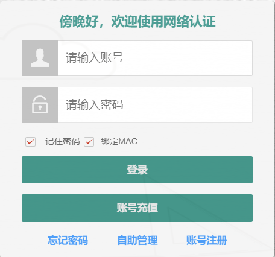
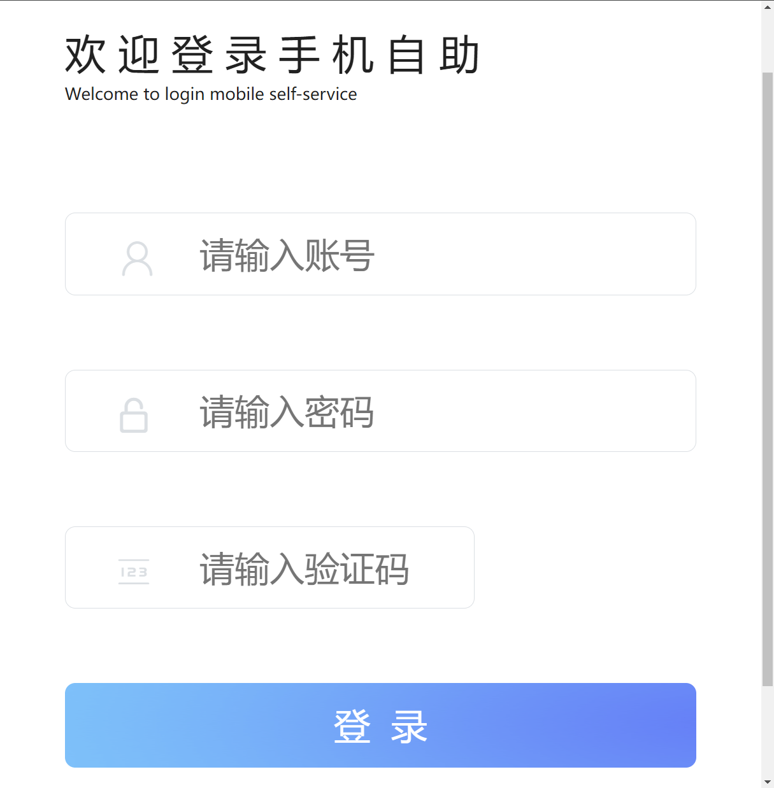

# zax_autologin
ZAXSOFT 石斧软件校园网自动登录脚本

# 使用方法
修改[net.sh](https://github.com/JiangTx/zax_autologin/blob/main/net.sh) 中

userId='用户名'

passwd='密码'

按需修改认证网页地址/认证服务器wlanacip/认证vlan/认证wlanacname

# net.service 使用

net.service放置在/etc/init.d目录下  设置为开机自启动

service net.service start | stop | restart

添加计划任务(可选)

# 适用场景
登录界面为

自助管理登录界面为

# 使用报告
在OpenWRT设备测试通过 LED代码适配京东云一代

京东云一代使用 ShellClash & [UA3F](https://github.com/SunBK201/UA3F/blob/master/README.md#ua3f) 在100Mbps下宽带尚为可用 

MT7621 的性能已经很吃力了 建议需要跑UA3F(防共享检测)的同学使用性能更好的路由器

# 校园网多设备检测

[UA3F](https://github.com/SunBK201/UA3F/blob/master/README.md#ua3f)(需搭配ShellClash/OpenClash使用)

[UA2F](https://github.com/Zxilly/UA2F)

# 提点思路

可自定义User-Agent  需要和防检测软件一起修改

可实现一台路由器认证为手机   另一台路由器认证为电脑

若还有多余的路由器就可以实现多拨

# 声明

本脚本并非破解软件，不提供破解功能，无任何入侵和破解行为。

本脚本免费发布并无任何盈利行为，请勿商用。

# 参考项目

[liuzhijie443/xywpojie-zaxsoft](https://github.com/liuzhijie443/xywpojie-zaxsoft) 

[Jin-Cheng-Ming/ZHKU-Connector](https://github.com/Jin-Cheng-Ming/ZHKU-Connector)

[LingMessy/zkNet](https://github.com/LingMessy/zkNet)
